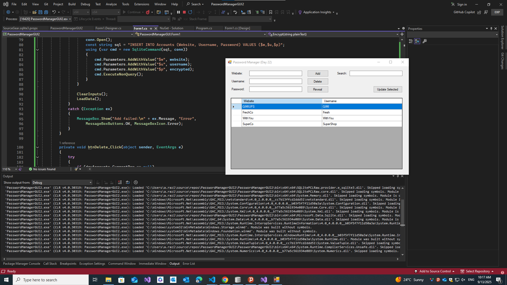

# 🔐 Password Manager GUI (Update + Search)

**Day 22** of my **30-Day C# Project-Based Learning Plan**  
This project extends the Password Manager built in Day 21 by adding **Update** and **Search** features. It’s built with **C# WinForms** and **SQLite**, focusing on database CRUD operations, encryption, and real-world debugging of platform issues.

---

## 🚀 Features
- ➕ Add new accounts (Website, Username, Password)
- ✏️ Update selected account (Website/Username, optional Password)
- ❌ Delete selected accounts
- 👀 Reveal stored password (AES-encrypted in DB)
- 🔍 Search bar to filter accounts by Website or Username
- 📋 Display results in a DataGridView with auto-fit columns
- 💾 SQLite persistence (`passwords.db` auto-created if missing)

---

## 🛠 Tech Stack
- **C# (.NET Framework 4.7.2)**
- **WinForms** (UI)
- **SQLite** via `Microsoft.Data.Sqlite`
- **AES Encryption** with `System.Security.Cryptography`

---

## 🧩 Challenges Faced
- Fixed a **compile error** from `Any CPU` builds by switching Solution + Project to **x64** in Configuration Manager.
- Corrected UI code (`AutoSizeColumnsMode.Fill` instead of `Fit`).
- Learned how to use **UPDATE** queries in SQLite with parameters.
- Implemented a **live search filter** with `LIKE` queries.
- Strengthened understanding of **DataGridView events** (`CellClick` → load into inputs).

💡 **Key Learning:** Handling updates and search filters in WinForms teaches both **SQL operations** and **UI-to-database binding**.

---

## 📸 Screenshots
| 🔐 | 
|------|
|  |

---

## 📚 Learning Goals

- Implement Update (SQL UPDATE) in a GUI app

- Add Search/Filter functionality with LIKE

- Use DataGridView events for row selection

- Debug UI and platform-specific build issues

- Strengthen full CRUD knowledge in C#
